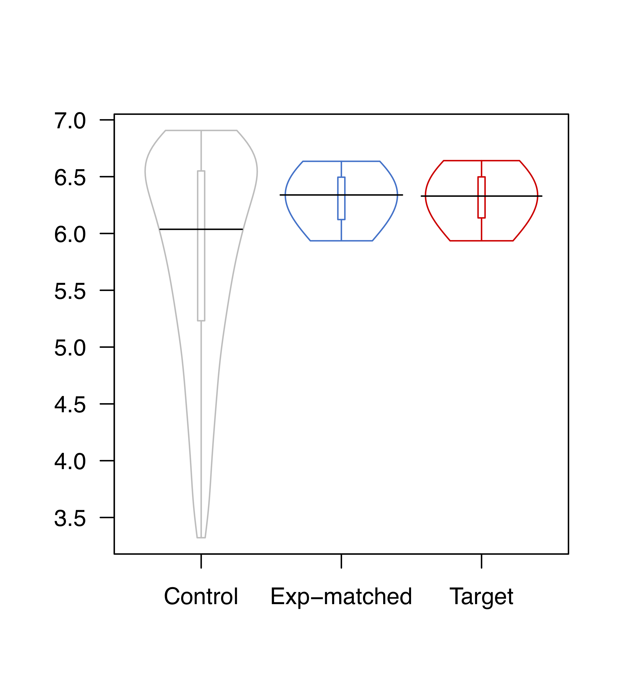

# Expression Matching

This is a simple function to generate expression-matched gene sets in R, written by Benjamin J. E. Martin (Karen Adelman Lab).

To do this you will need three things:

1. A vector of GeneIDs for your gene set of interest (e.g., upregulated genes)
1. A vector of GeneIDs for your control gene set (e.g., unchanged genes)
1. A 2-column dataframe with the expression level (or some other parameter for matching expression) for each gene: the first column should contain the GeneID and the 2nd column should contain the expression values (e.g. FPKM, or PRO-seq reads/kb). 

This quantile matching works by first splitting your genes of interest into quantile groups (of expression) and then pulling a similar number of genes from your control set for each expression quantile. 

## Defining the function
To pull out expression matched genes, we'll first make a R function (called expressionMatched) that can do the expression matching:
```
expressionMatched <- function(geneset,ctrlgeneset,dat,numQuantGroups,CtrlSetRatio=1,setSeedNum=1){  
  #pull out the relevant columns from the dataframe given
  geneIDs <- as.character(dat[,1])
  expressionValues <- as.numeric(dat[,2])

  
  #pull out geneset quantile values
  de_set_quantiles <- quantile(expressionValues[geneIDs %in% as.character(geneset)],seq(0,1,1/numQuantGroups))
  
  #calculate the number of ctrl genes to pull per quantile group
  num_per_quantile <- CtrlSetRatio*round(length(geneset)/numQuantGroups,0)
  
  #create an empty character object to add expression matched genes too
  ctrlGenes <- character()
  
  #loop to pull out genes from each quantile group
  for (i in 1:(length(de_set_quantiles)-1)){
    #use set.seed to make the random sampling reproducible
    set.seed(setSeedNum)
    #Randomly select "num_per_quantile" genes from the ctrlgeneset for each quantile group of geneset expression
    x <- sample(geneIDs[geneIDs %in% as.character(ctrlgeneset) & 
                                              expressionValues >= de_set_quantiles[i] & 
                                              expressionValues < de_set_quantiles[(i+1)]],num_per_quantile)
    #add the genes to the growing vector of ctrlGenes                              
    ctrlGenes <- c(ctrlGenes,x)
    
  }
  #return the finished list of ctrlGenes
  return(ctrlGenes)
}
```

#### This function has 4 required inputs:

1. geneset = a vector of GeneIDs for your gene set of interest (e.g., upregulated genes)
1. ctrlgeneset = a vector of GeneIDs for your control gene set (e.g., unchanged genes)
1. dat = a 2-column dataframe with the expression level (or some other parameter for matching expression) for each gene: the first column should contain the GeneID and the 2nd column should contain the expression values (e.g. RNA-seq read density or PRO-seq reads/kb). 
1.  numQuantGroups = the number of quantile groups to use for expression matching. 
Note* If you pick too large a number here the script will fail, as your control set of genes needs to have enough genes covering each quantile of expression values. We recommend starting at 10 and then reducing this if the matching fails, until you have sufficient genes to match each quantile group.

This function also has 2 optional inputs: 
1. CtrlSetRatio = the ratio of expression matched genes to target set to return. 
This is set to 1 by default, which returns the same number of genes as your geneset of interest (within a small margin). A CtrlSetRatio of 0.5 will return half the number of genes as your geneset of interest. If your geneset of interest has a very skewed expression profile, then you may have to lower the CtrlSetRatio parameter, to adequately cover the expression quantiles of your gene-set of interest. 
1. setSeedNum = Set seed #, set to 1 by default. This is for reproducibility, which means that the function will return the same set of matched genes every time it is run. Vary this number to generate different expression matched gene sets.

To run the function, enter something like this:
```
ExpressionMatchedCtrlGenes <- expressionMatched(geneset,ctrlgeneset,dat,numQuantGroups=10)
```

This will return an expression-matched set of control genes, as a character vector of gene IDs. Note that this only works if your "unchanged" set contains genes covering the expression quantiles of your gene-set of interest. If this is not the case you will get the following error:

> Error in sample.int(length(x), size, replace, prob) : 
> 
>   cannot take a sample larger than the population when 'replace = FALSE' 

In this case you can decrease the number of quantile groups, or play with the CtrlSetRatio ratio until the expression matching works.

## Test example
Here I will make a test example using simulated data. This will have 100 target genes and 1000 control genes. 

```
target_genes <- paste0("Target_gene_",1:100)
control_genes <- paste0("Control_gene_",1:1000)

set.seed(1)
target_values <- sample(seq(60,100,0.1),100)

set.seed(1)
control_values <- sample(seq(10,120,0.1),1000)

test_dataframe <- data.frame(GeneID=c(target_genes,control_genes),
                             Expression=c(target_values,control_values))

```

Then to generate the expression-matched geneset:
```
ExpressionMatchedCtrlGenes <- expressionMatched(geneset=target_genes,
                                                ctrlgeneset=control_genes,
                                                dat=test_dataframe,
                                                numQuantGroups=10)

#and we can pull out the expression matched gene expression values like so, which is useful for QC
ExpressionMatchedCtrlGenes_values <- test_dataframe$Expression[test_dataframe$GeneID %in% ExpressionMatchedCtrlGenes]

```

### QC on generated expression matched gene set

#### Check summary stats for the control, target, and expression matched gene sets
```
summary(control_values)
```
```
##    Min. 1st Qu.  Median    Mean 3rd Qu.    Max. 
##   10.00   37.58   65.65   65.50   93.72  120.00
```

```
summary(target_values)
```
```
##    Min. 1st Qu.  Median    Mean 3rd Qu.    Max. 
##   61.20   70.38   80.40   80.34   90.38   99.80
```

```
summary(ExpressionMatchedCtrlGenes_values)
```
```
##    Min. 1st Qu.  Median    Mean 3rd Qu.    Max. 
##   61.20   69.67   80.95   80.37   90.22   99.40
```

#### Perform statistical tests to check whether the exp-matched set is different than the target gene set
Perform Mann-Whitney (or Wilcoxon Rank Sum) test on control and target gene sets:
```
wilcox.test(control_values,target_values)
```
>  Wilcoxon rank sum test with continuity correction
> 
> data:  control_values and target_values
> 
> W = 37020, p-value = 1.827e-05
> 
> alternative hypothesis: true location shift is not equal to 0

Perform Mann-Whitney (or Wilcoxon Rank Sum) test on control and target gene sets:
```
wilcox.test(ExpressionMatchedCtrlGenes_values,target_values)
```
>  Wilcoxon rank sum test with continuity correction
> 
> data:  ExpressionMatchedCtrlGenes_values and target_values
> 
> W = 5012.5, p-value = 0.9766
> 
> alternative hypothesis: true location shift is not equal to 0

#### Plot the distribution of values in control, target, and expression matched gene sets

I recommend making a violin plot for the expression values in each of your genesets, either in Prism or quickly in R like so (using the vioplot package):
```
library(vioplot)

vioplot(log2(control_values),
        log2(ExpressionMatchedCtrlGenes_values),
        log2(target_values),
        ylog=F,na.rm=T,plotCentre="line",cex.names=1,
        names=c("Control","Exp-matched","Target"),h=0.25,
        col="white",border=c("gray","dodgerblue3","red2"),
        rectCol="white",lineCol=c("gray","dodgerblue3","red2"),
        colMed=c("gray","dodgerblue3","red2"),
        colMed2=c("gray","dodgerblue3","red2"),las=1)


```


#### print out session info
My R session info
```
sessionInfo()
```
```
## R version 4.0.3 (2020-10-10)
## Platform: x86_64-apple-darwin17.0 (64-bit)
## Running under: macOS Mojave 10.14.6
## 
## Matrix products: default
## BLAS:   /Library/Frameworks/R.framework/Versions/4.0/Resources/lib/libRblas.dylib
## LAPACK: /Library/Frameworks/R.framework/Versions/4.0/Resources/lib/libRlapack.dylib
## 
## locale:
## [1] en_US.UTF-8/en_US.UTF-8/en_US.UTF-8/C/en_US.UTF-8/en_US.UTF-8
## 
## attached base packages:
## [1] stats     graphics  grDevices utils     datasets  methods   base     
## 
## other attached packages:
## [1] vioplot_0.3.5 zoo_1.8-8     sm_2.2-5.6   
## 
## loaded via a namespace (and not attached):
##  [1] lattice_0.20-41   digest_0.6.27     grid_4.0.3        magrittr_2.0.1   
##  [5] evaluate_0.14     highr_0.8         rlang_0.4.10      stringi_1.5.3    
##  [9] rmarkdown_2.6     tools_4.0.3       stringr_1.4.0     xfun_0.20        
## [13] yaml_2.2.1        compiler_4.0.3    tcltk_4.0.3       htmltools_0.5.1.1
## [17] knitr_1.31
```
